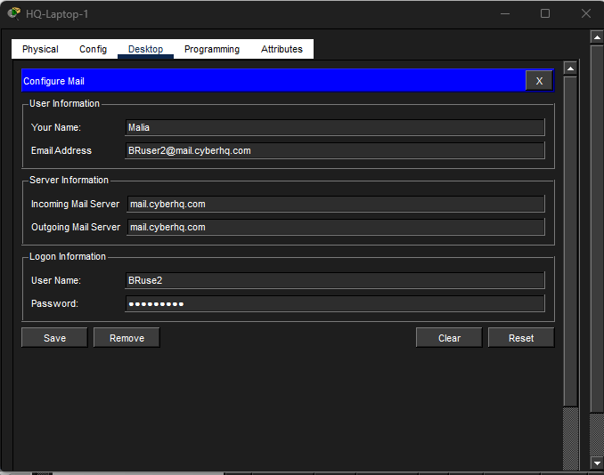
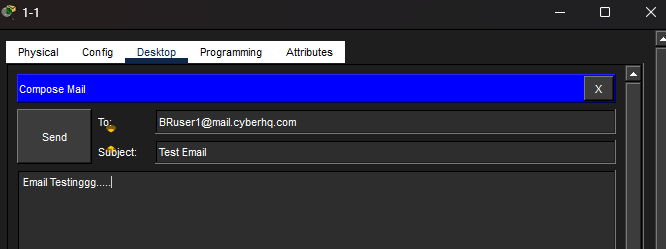
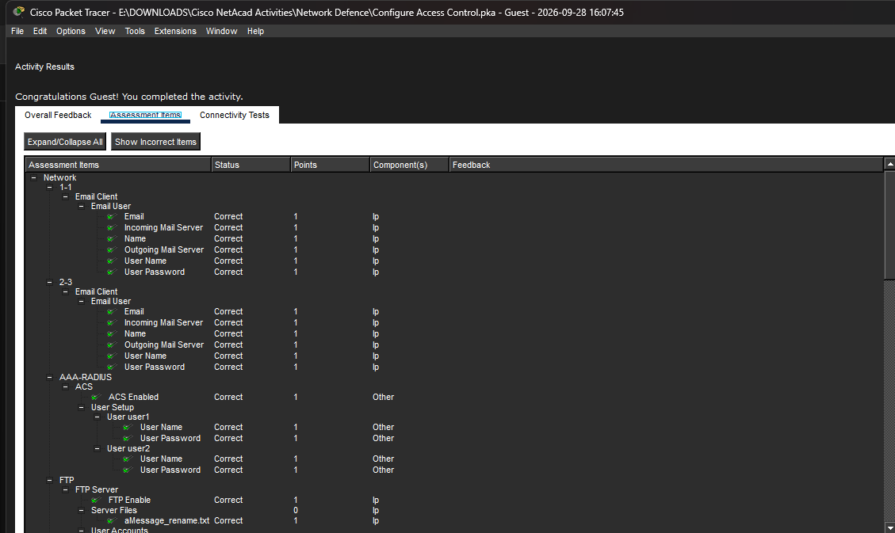

# Cisco Packet Tracer - Configure Access Control

## Overview

This lab focused on **authentication and authorization** for common network services using Cisco Packet Tracer.

The activity demonstrated how authentication verifies a user's identity, while authorization determines what resources and actions that user is permitted to access.

The lab covered:

- AAA/RADIUS authentication for wireless network access
- WPA2 wireless authentication
- DHCP-based IP configuration
- SMTP and POP3 email services
- FTP user authentication and authorization
- FTP file transfer and user privilege testing
- Access-control validation through Cisco Packet Tracer's assessment system

---

## Objectives

### Part 1 — Configure and Use AAA Authentication Credentials

- Configure user accounts on an AAA/RADIUS server.
- Configure WPA2 authentication for wireless clients.
- Authenticate wireless users against the AAA server.
- Obtain IP addressing through DHCP.

### Part 2 — Configure and Use Email Services

- Enable SMTP and POP3 services.
- Configure an email domain and user accounts.
- Configure email clients.
- Send and receive an email between network users.

### Part 3 — Configure and Use FTP Services

- Enable the FTP service.
- Create FTP users with different privileges.
- Download and upload files using FTP.
- Test authorization by attempting restricted file operations.
- Verify the difference between users with and without delete permissions.

---

## Environment

**Platform:** Cisco Packet Tracer

**Lab Mode:** Physical mode

**Services configured:**

- AAA/RADIUS
- Wireless authentication
- DHCP
- SMTP
- POP3
- FTP

---

# Part 1 — AAA Authentication and Wireless Access

## 1. AAA/RADIUS User Configuration

The AAA/RADIUS service was enabled on the `AAA-RADIUS` server.

Two authentication accounts were configured for wireless users:

| Username | Purpose |
|---|---|
| `user1` | HQ-Laptop-1 authentication |
| `user2` | HQ-Laptop-2 authentication |

The AAA server was used as the centralized authentication service for the wireless clients.

> Passwords used in the lab are not documented here to avoid publishing credentials.

---

## 2. Wireless Authentication

The wireless interface on both HQ laptops was configured with:

- **SSID:** `HQ-INT`
- **Authentication:** WPA2
- **AAA credentials:** Configured according to the assigned user account
- **IP configuration:** DHCP

### HQ-Laptop-1

Configured to authenticate using the `user1` AAA account.

### HQ-Laptop-2

Configured to authenticate using the `user2` AAA account.

Both clients were configured to obtain their network addressing through DHCP.

The expected wireless network was:

```text
192.168.50.0/24
```

### Security Concept

This configuration demonstrates centralized authentication, where users authenticate against an AAA service rather than relying only on locally configured credentials on each wireless client.

---

# Part 2 — Email Services

## 1. Mail Server Configuration

The Packet Tracer `Mail` server was configured as the network email server.

The following services were enabled:

- **SMTP**
- **POP3**

The configured email domain was:

```text
mail.cyberhq.com
```

Four email accounts were created for the lab users:

| User | Email Address |
|---|---|
| HQuser1 | `HQuser1@mail.cyberhq.com` |
| HQuser2 | `HQuser2@mail.cyberhq.com` |
| BRuser1 | `BRuser1@mail.cyberhq.com` |
| BRuser2 | `BRuser2@mail.cyberhq.com` |

Passwords are intentionally not included in this README.

---

## 2. Email Client Configuration

The email clients were configured using the Packet Tracer email application.

The configuration included:

- User's display name
- Email address
- Incoming mail server
- Outgoing mail server
- Username
- Password

The configured mail server was:

```text
mail.cyberhq.com
```

The following clients were configured:

| Device | User |
|---|---|
| PC 1-1 | Suk-Yi / HQuser1 |
| PC 2-3 | Ajulo / BRuser1 |
| HQ-Laptop-1 | Malia / BRuser2 |
| Net-Admin | Cisco / HQuser2 |

---

## 3. Email Transmission Test

An email was composed from **Suk-Yi (PC 1-1)** and sent to:

```text
BRuser1@mail.cyberhq.com
```

The email was then checked from **Ajulo's PC (PC 2-3)**.

This verified that the configured email services and client settings were functioning within the Packet Tracer simulation.

### Evidence



*Email client configuration in Cisco Packet Tracer.*



*Email transmission/verification test.*

---

# Part 3 — FTP Services

## 1. FTP Server Configuration

The FTP service was enabled on the Packet Tracer `FTP` server.

Three FTP accounts were configured with different authorization levels.

| Username | Privileges |
|---|---|
| `sukyi` | RWDNL |
| `ajulo` | RWDNL |
| `malia` | RWNL |

Where:

- **R** = Read
- **W** = Write
- **D** = Delete
- **N** = Rename
- **L** = List

The important difference is that **Malia does not have the Delete (`D`) privilege**.

---

## 2. File Download

From the `Net-Admin` PC, an FTP connection was established to:

```text
192.168.75.2
```

The `sukyi` account was used to authenticate to the FTP server.

The directory contents were viewed using:

```text
dir
```

The existing file was downloaded using:

```text
get aMessage.txt
```

The downloaded file was then opened using the Packet Tracer text editor.

---

## 3. File Upload

A new text file was created locally:

```text
aMessage_new.txt
```

The file was uploaded to the FTP server using:

```text
put aMessage_new.txt
```

This demonstrated the Write privilege of the FTP user.

---

# 4. FTP Authorization Testing

The FTP privileges of the `malia` account were tested from `HQ-Laptop-1`.

The user was able to connect to the FTP server using the configured account.

### Delete Test

The following command was used:

```text
delete aMessage_new.txt
```

The operation was rejected because `malia` does not have the **Delete (`D`)** privilege.

This demonstrates that authentication alone does not give a user unrestricted access.

### Rename Test

The following command was then used:

```text
rename aMessage_new.txt aMessage_rename.txt
```

The rename operation was allowed because `malia` has the **Rename (`N`)** privilege.

### Security Significance

This is an example of **authorization based on least privilege**.

The user can perform permitted operations such as:

```text
Read
Write
Rename
List
```

but cannot perform:

```text
Delete
```

because that permission was intentionally excluded from the account.

---

# Authentication vs Authorization

This lab demonstrated the difference between two important security concepts.

### Authentication

**Authentication answers:**

> "Who are you?"

Examples from this lab:

- AAA/RADIUS username and password authentication
- Wireless WPA2 authentication
- Email username/password authentication
- FTP username/password authentication

### Authorization

**Authorization answers:**

> "What are you allowed to do?"

The clearest example was the FTP configuration.

`sukyi` and `ajulo` received:

```text
RWDNL
```

while `malia` received:

```text
RWNL
```

Therefore, Malia could rename files but could not delete them.

---

# Verification

The completed Packet Tracer activity was checked using the built-in **Check Results / Assessment Items** feature.

The completed configuration achieved:

**100% assessment completion**



*Cisco Packet Tracer assessment showing the completed lab configuration.*

The assessment was used to verify the required configuration items for the lab.

---

# Key Security Concepts Learned

### 1. Centralized Authentication

AAA/RADIUS can provide centralized authentication for network access instead of maintaining independent credentials on every device.

### 2. Authentication and Authorization Are Different

A user can successfully authenticate but still be restricted from performing certain actions.

### 3. Least Privilege

Users should receive only the permissions necessary for their tasks.

The `malia` FTP account demonstrates this principle because the account can read, write, rename, and list files but cannot delete them.

### 4. Service Authentication

Network services such as email and FTP can require user authentication before allowing access.

### 5. Role-Based Permissions

Different FTP users can have different capabilities depending on the privileges assigned to their accounts.

---

# Skills Demonstrated

- Cisco Packet Tracer
- AAA/RADIUS configuration
- User authentication
- WPA2 wireless authentication
- DHCP configuration and verification
- SMTP configuration
- POP3 configuration
- Email client configuration
- FTP server configuration
- FTP user management
- File upload/download
- File permission testing
- Authentication vs authorization
- Least-privilege access control
- Network service troubleshooting
- Basic network security

---

# Files

```text
Configure-Access-Control/
├── README.md
├── Configure-Access-Control.pkt
└── screenshots/
    ├── email-configuration.png
    ├── email-test.png
    └── assessment-100-percent.png
```

The `.pkt` file contains the completed Cisco Packet Tracer topology and configuration.

---

## Conclusion

This lab provided hands-on practice with **authentication and authorization across multiple network services**.

The most important takeaway was that successful authentication does not automatically provide unrestricted access. Proper authorization and least-privilege permissions are required to control what authenticated users can actually do.

The lab was successfully completed and verified using Cisco Packet Tracer's assessment system with **100% completion**.