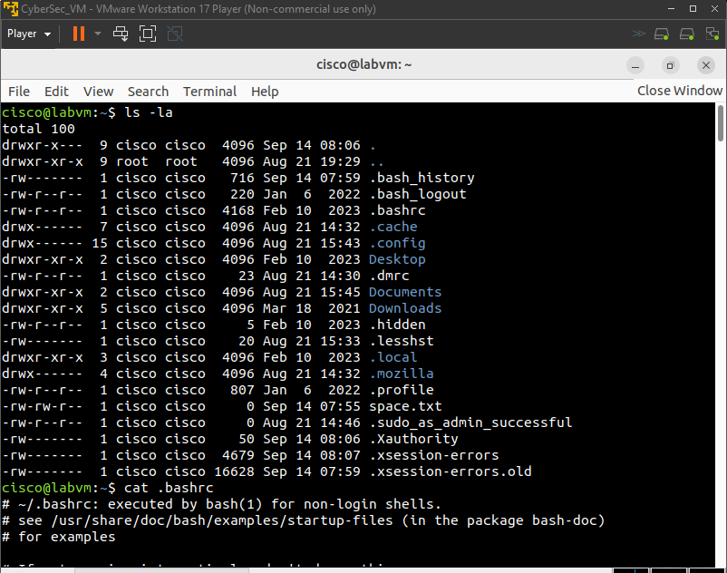
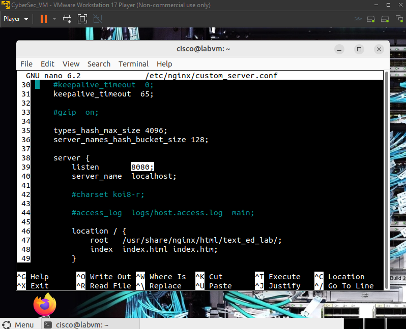
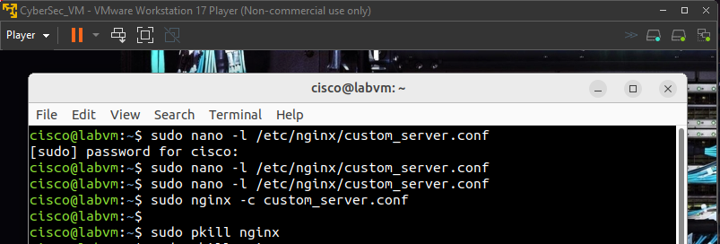
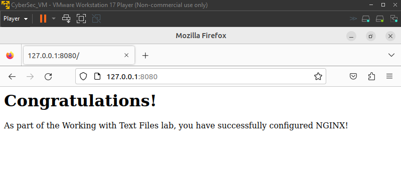

# Working with Text Files and Configuration Files

A Linux administration lab completed as part of the **Cisco Networking Academy Junior Analyst coursework**. The lab focused on working with text files, command-line editors, Linux configuration files, permissions, and basic Nginx service configuration.

## Objectives

* Work with graphical and command-line text editors
* Navigate and inspect files using the Linux CLI
* Understand hidden user configuration files
* Edit shell configuration using `.bashrc`
* Understand user-level and system-wide configuration
* Modify a system service configuration using `sudo`
* Configure and test an Nginx web server

## Tools & Technologies

* Linux
* Bash
* SciTE
* GNU nano
* Nginx
* Terminal / CLI
* `sudo`

## Tasks Completed

### 1. Working with Text Files and Editors

* Created and opened a text file using **SciTE**
* Opened the file from the terminal using `scite`
* Edited the file using **GNU nano**
* Practiced basic navigation, editing, and saving operations

### 2. Linux Configuration Files

* Inspected hidden files in the user's home directory using:

```bash
ls -la
```

* Examined the `.bashrc` shell configuration file:

```bash
cat .bashrc
```

* Modified the Bash prompt configuration
* Reloaded the Bash shell to apply the configuration changes

### 3. System-Wide Configuration

* Explored the `/etc` directory and identified system-wide configuration files
* Examined `/etc/bash.bashrc`
* Used `sudo` when working with system-level configuration files

### 4. Nginx Configuration

Modified the Nginx configuration to:

* Change the listening port from **81 to 8080**
* Change the web root to a custom directory
* Start Nginx using the modified configuration
* Test the web server locally through a browser at:

```text
http://127.0.0.1:8080
```

* Stop the Nginx process after testing

## Key Commands

```bash
ls
ls -la
cat .bashrc
nano space.txt
nano .bashrc
sudo nano -l /etc/nginx/custom_server.conf
sudo nginx -c custom_server.conf
sudo pkill nginx
```

## Key Learning

This lab provided practical experience with Linux text editors, hidden configuration files, file permissions, privileged administration, and basic web-server configuration.

It also demonstrated how changes to configuration files can directly affect system and service behavior.

## Evidence

### Terminal — File and Configuration Inspection



### Nano — Command-Line Text Editing



### Nginx — Configuration and Commands



### Nginx — Web Server Test


