# Windows User Account Management Lab

## Overview

This lab demonstrates how to create, manage, and modify local user accounts in Windows. It covers account creation, permission verification, group membership, privilege escalation, and account deletion using both the Control Panel and Computer Management.

---

## Objectives

* Create a new local user account.
* Review user account permissions.
* Understand standard and administrator privileges.
* Modify account types and group memberships.
* Delete local user accounts.
* Explore Windows security and access control.

---

## Lab Environment

| Item                 | Details                                             |
| -------------------- | --------------------------------------------------- |
| Operating System     | Windows 10/11                                       |
| Administrative Tools | Control Panel, Computer Management                  |
| User Accounts        | LENOVOADMIN (Administrator), User1 (Local Account) |
| Difficulty           | Beginner                                            |

---

# Part 1 – Creating a Local User Account

## Task

Created a new local account named **User1** without using a Microsoft account.

### Result

* Successfully created a **Standard Local User**.
* The account initially had **no administrative privileges**.

### Observation

A newly created local account belongs to the **Users** group by default, providing only standard user permissions.

---

## Folder Permission Verification

Logged into **User1** and examined the security permissions for the user profile directory.

### User1 Folder Permissions

Users and groups with Full Control:

* SYSTEM
* Administrators
* User1

### Attempted Access to Another User Profile

Tried accessing the **LENOVOADMIN** profile.

### Observation

Access was denied because User1 did not have sufficient permissions.

### Learning Outcome

Windows protects user profiles using NTFS permissions to prevent unauthorized access to other users' data.

---

## Administrator Profile Verification

Logged back into **LENOVOADMIN** and reviewed the permissions on its profile folder.

### Users with Full Control

* SYSTEM
* Administrators
* LENOVOADMIN

---

# Part 2 – Reviewing User Properties

Opened **Computer Management → Local Users and Groups** to examine user account properties.

---

## User1

### Group Membership

```text
Users
```

### Observation

Standard users have limited permissions and cannot make system-wide changes.

---

## LENOVOADMIN

### Group Membership

```text
Users
Administrators
```

### Observation

Administrator accounts have elevated privileges allowing software installation, system configuration, and user management.

---

# Part 3 – Modifying User Accounts

## Promoting User1 to Administrator

Changed the account type from **Standard User** to **Administrator**.

### Updated Group Membership

```text
Administrators
Users
```

### Learning Outcome

Adding a user to the **Administrators** group grants elevated system privileges.

---

## Removing Administrative Privileges

Removed **User1** from the **Administrators** group.

### Observation

The account returned to standard user privileges while remaining a member of the **Users** group.

---

## Deleting the User Account

Deleted **User1** using **Computer Management**.

### Alternative Method

The account can also be deleted through:

```text
Control Panel
→ User Accounts
→ Manage another account
→ Select User1
→ Delete the account
```

---

# Security Concepts Learned

### Strong Passwords

Strong passwords protect user accounts from unauthorized access, reducing the risk of data theft, privilege abuse, and system compromise.

---

### Why Use Standard User Accounts?

Using standard accounts for everyday activities follows the **Principle of Least Privilege**, reducing the risk of accidental system changes and limiting the impact of malware or unauthorized software execution.

---

# Skills Demonstrated

* Windows User Management
* Local Account Administration
* User Group Management
* NTFS File Permissions
* Windows Security
* Computer Management Console
* Account Privilege Management
* Access Control
* System Administration

---

# Screenshots

## Part 1 – Creating a New Local User Account

### Step 1 

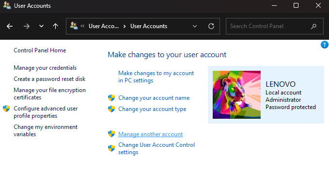

### Step 2 

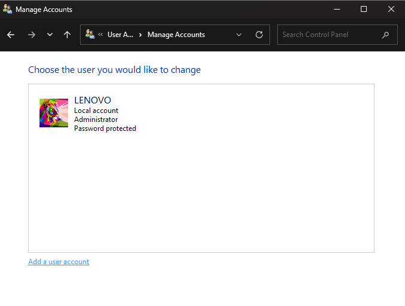

### Step 3 

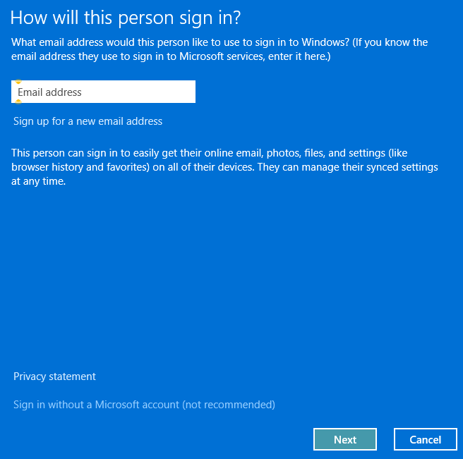

### Step 4 – 

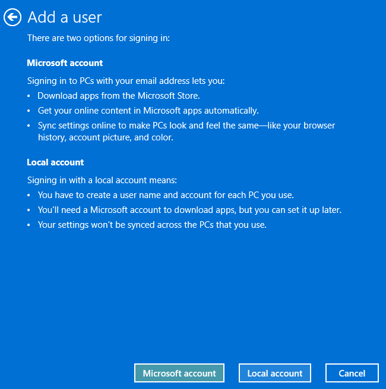

### Step 5 – 

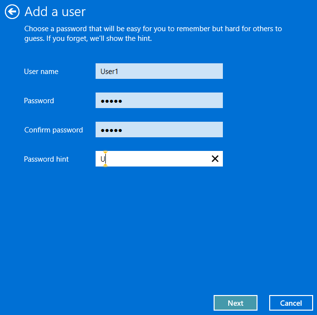

### Step 6 – 

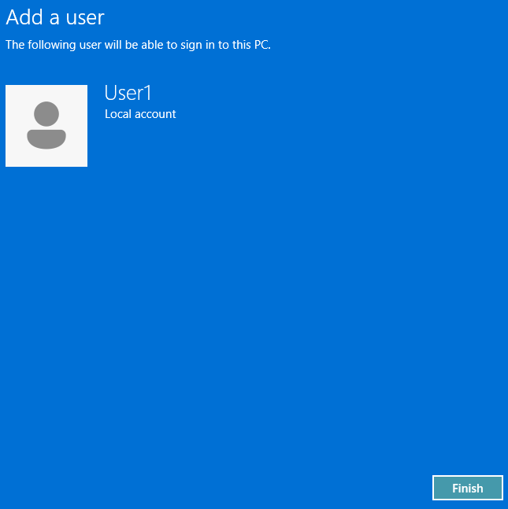

### Step 7 – 

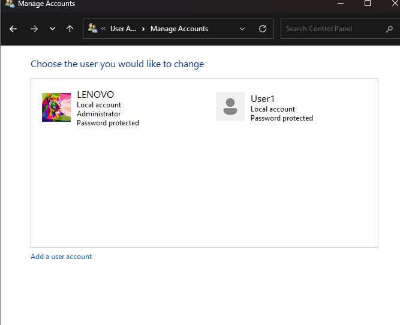

---

## Part 2 – Reviewing User Account Properties

### Step 1

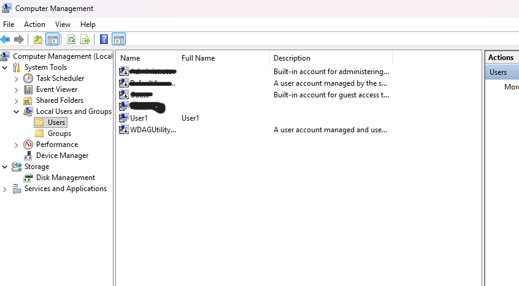

### Step 2
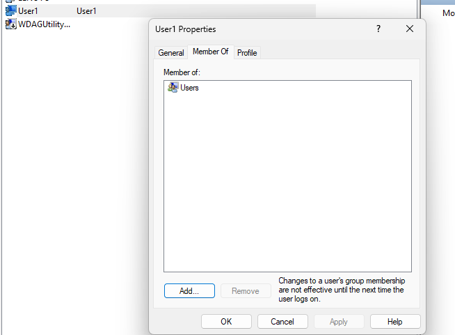

---

## Part 3 – Modifying User Accounts

### Step 1 
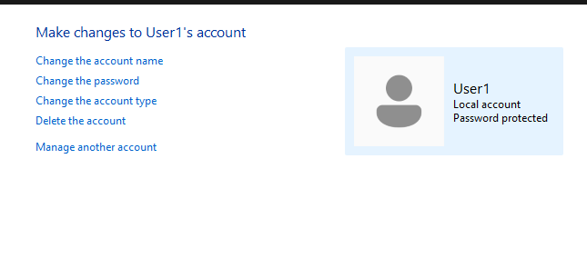

### Step 2 

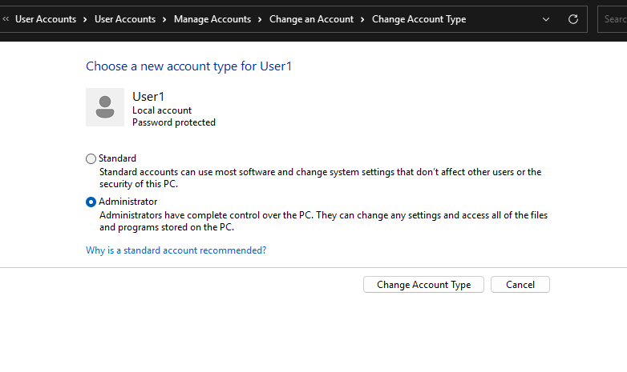

### Step 3 

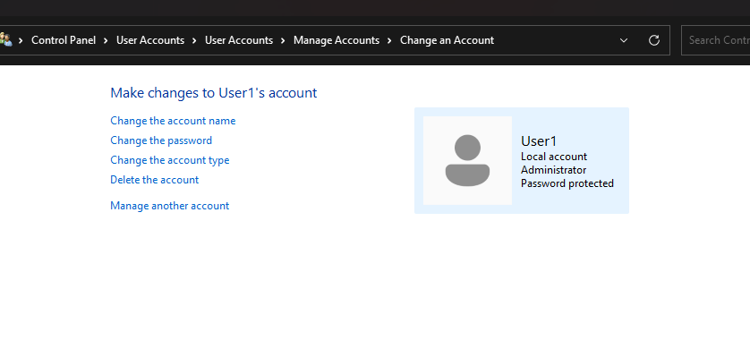

### Step 4 

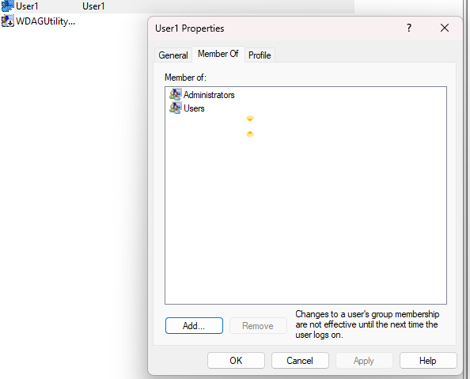

### Step 5 

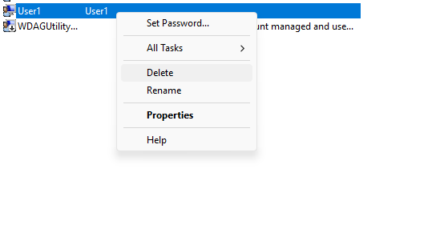

---

# Key Takeaways

* Created and managed local Windows user accounts.
* Verified folder ownership and NTFS permissions.
* Explored user group memberships.
* Modified account privileges by changing group membership.
* Practiced secure account administration.
* Learned the importance of least privilege and strong authentication.

---

## Author

**Kainat Mustajab**

BS Information Technology

Aspiring Network Engineer | Windows Administration | Cybersecurity Enthusiast
